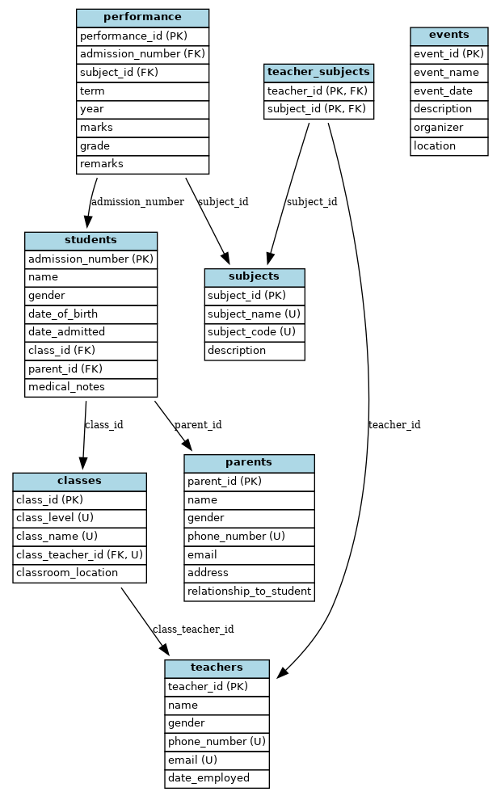

# Rehema Academy Database Project

## 📘 Project Description

This SQL project models the database of Rehema Academy, a fictional school. It captures information about students, parents, teachers, subjects, classes, academic performance, events in the school and teacher-subject assignments. The schema ensures data integrity using constraints and enforces relationships through foreign keys.

### ✅ Key Features
- Tables with primary, foreign key, NOT NULL, and UNIQUE constraints
- Proper implementation of 1:1, 1:M, and M:M relationships
- Prepopulated data for testing and analysis (e.g., 85 students, 8 teachers, 80 parents)

---

## 🚀 How to Run the Project

1. Open your MySQL client (e.g., MySQL Workbench, phpMyAdmin).
2. Create a new database:
   ```sql
   CREATE DATABASE rehema_academy;
   USE rehema_academy;
 OR 
3. Import the .sql file:
    Either copy-paste the contents into your SQL editor
    Or use the import tool in your database environment

## ERD DIAGRAM OF THE TABLES



